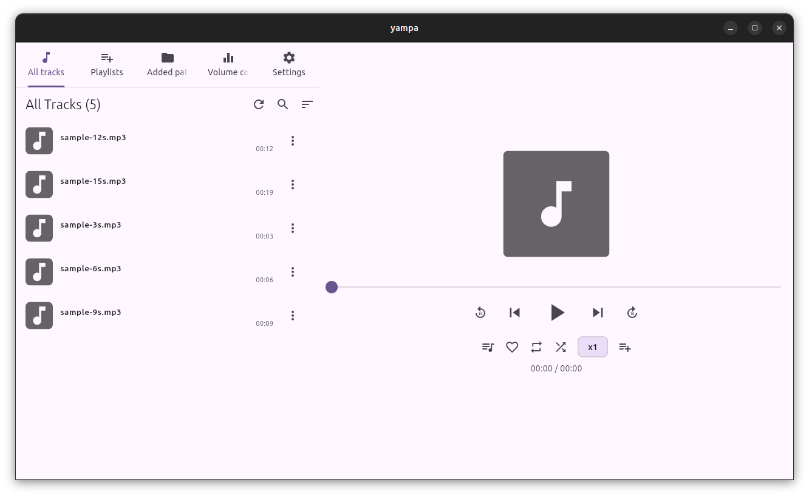
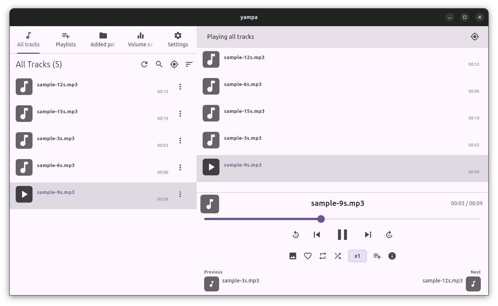
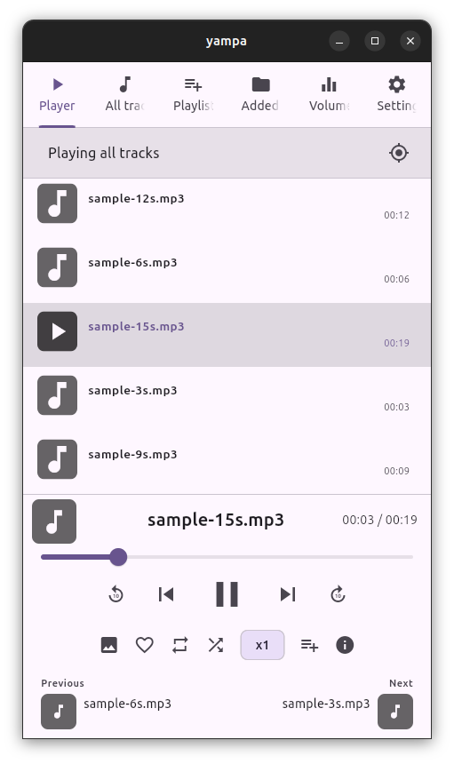
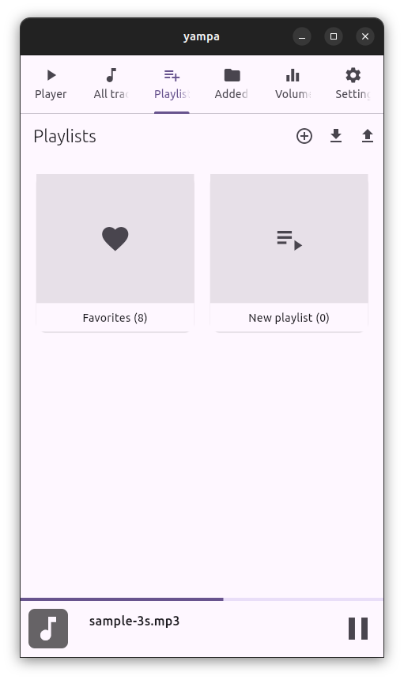

# YAMPA - Yet Another Music player App

Simple music player app.

## Screenshots







## Dependencies
```
apt install libmpv-dev libsqlite3-0 libsqlite3-dev
```

## Building

You can either build the app with Docker by running the `make build/all` command (you can also target a specific platform, see the `Makefile` file), or install Flutter manually and run `flutter build --release`.
