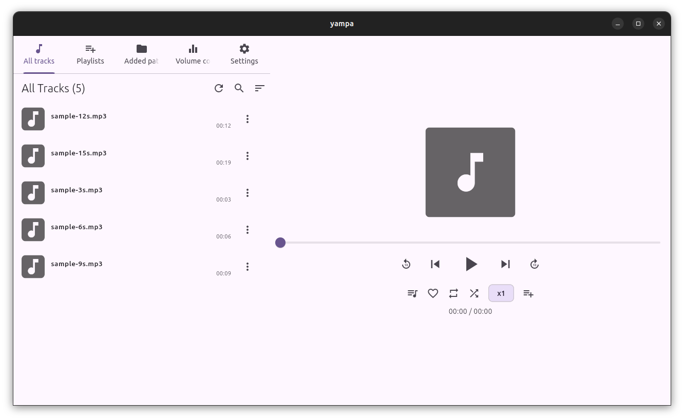
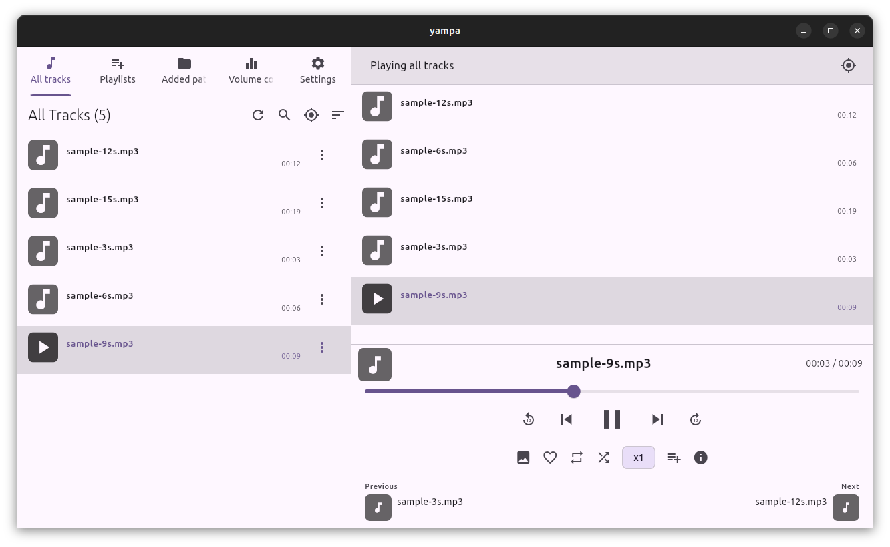
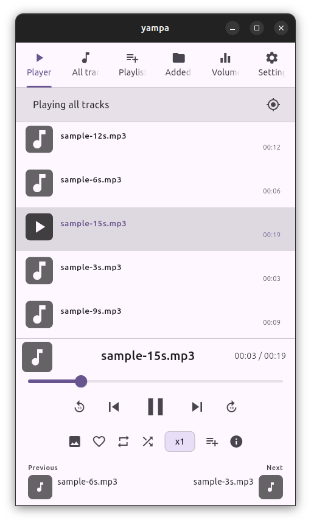
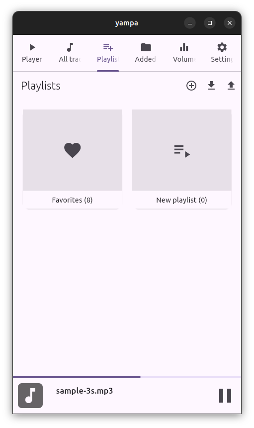

# YAMPA - Yet Another Music player App

Simple music player app.
This app is currently in alpha state. Expect bugs and active development.

<a href="https://www.buymeacoffee.com/franlmsp" target="_blank"></a>

## Screenshots







## Dependencies
```
apt install libmpv-dev libsqlite3-0 libsqlite3-dev
```

## Building

You can either build the app using Docker by running the `make build/all` command (you can also target a specific platform, see `Makefile`), or install Flutter manually and run `flutter build --release`.
